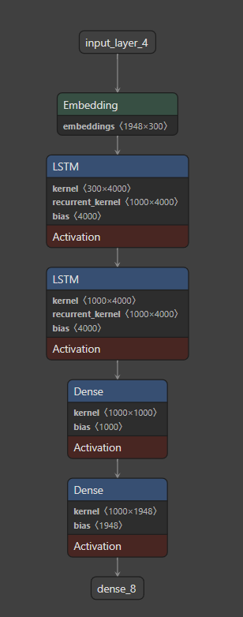

# Sentence Completion with LSTM and Word2Vec with Radiohead Content

This project uses LSTM neural networks and pre-trained word embeddings to generate text based on Radiohead content scraped from Wikipedia.

## Project Overview

This project demonstrates how to build a text generation model using LSTM neural networks. It scrapes Radiohead content from Wikipedia, processes the text, and trains a model to predict and generate new text based on input prompts. As a learning project, it covers fundamental NLP concepts including word embeddings, sequence modeling, and text generation.

## Features

- Web scraping of Radiohead content from Wikipedia
- Text preprocessing using spaCy and NLTK
- Implementation of pre-trained word embeddings (GloVe)
- LSTM architecture for sequence learning
- Sentence completion functionality

## Project Structure

```
.
├── lstm.ipynb                  # Simple LSTM implementation
├── sentence_completion.ipynb   # Notebook for sentence completion project with word2Vec
├── LSTM_with_word2Vec.h5       # Trained LSTM model with word embeddings
├── model.h5                    # Additional saved model
└── token.pkl                   # Tokenizer pickle file
```

## Technologies Used

- Python 3
- TensorFlow/Keras
- NLTK and spaCy for NLP preprocessing
- BeautifulSoup for web scraping
- GloVe word embeddings ("glove-wiki-gigaword-300")

## How It Works

1. **Data Collection**: Scrapes Radiohead content from Wikipedia
2. **Text Preprocessing**: Cleans and tokenizes text
3. **Word Embedding**: Uses pre-trained GloVe embeddings
4. **Model Training**: Implements and trains an LSTM model
5. **Text Generation**: Completes sentences based on input prompts

## Model Visualization



## Example Usage

```python
# Load the trained model and required components
# Example: Completing a sentence
start_text = "Radiohead are an"
completed = complete_sentence(start_text, nn, word_to_index, index_to_word, num_words=5)
print(completed)
# Output: "Radiohead are an english rock band formed in"
```

## Learning Outcomes

Through this project, I learned:

- Basic NLP concepts and techniques
- How to implement LSTM networks for text generation
- Working with pre-trained word embeddings
- Text preprocessing and tokenization techniques
- Model training and evaluation for sequence learning tasks

## Future Improvements

- Expand the dataset with more Radiohead-related content
- Implement more advanced architectures (e.g., Transformer models)
- Add temperature parameter for controlling randomness in generated text
- Create a simple web interface for text generation

## Requirements

See the notebook dependencies for complete requirements. Key packages include:

- tensorflow
- keras
- nltk
- spacy
- beautifulsoup4
- gensim
- numpy
- pandas

## Getting Started

1. Clone the repository
2. Install the required dependencies
3. Run the notebooks to see the implementation
4. Use the provided functions to generate your own text
